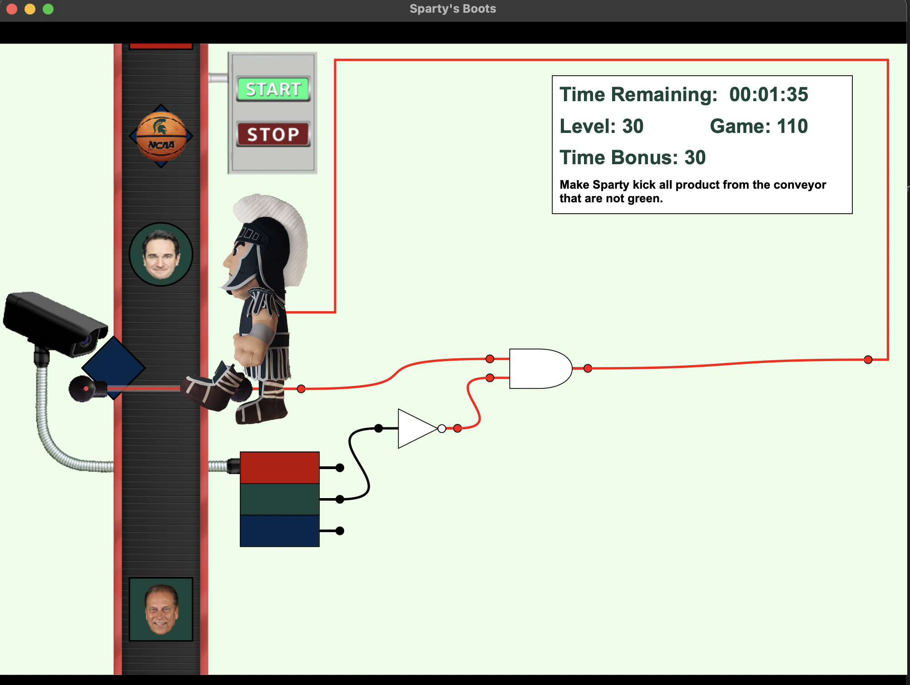

# Sparty's Boots

A C++ logic-based game where Sparty evaluates objects on a conveyor belt and kicks them off based on sensor input and combinational logic. Players connect `AND`, `OR`, and `NOT` gates, as well as `SR` and `D` flip-flops, to define valid logic paths that activate Sparty's kicking action. Built as a large-scale group project using GitHub for collaboration and version control.

## 🤝 Team Collaboration

This project was developed in a team using Git and GitHub to manage contributions. We structured the project across multiple files and modules, including custom-built GUI components, logic handling systems, and a level design format. Collaboration included managing merges, resolving conflicts, and building modular C++ code within a unified architecture.

## 🎮 Gameplay

- Conveyor belt delivers various objects
- Connect logic gates and flip-flops to define correct kick triggers
- Complete timed levels by kicking the right items
- Dynamic wiring interface for building logic paths

## 🧠 Skills Demonstrated

- C++17 programming and OOP design
- GUI development with wxWidgets
- Combinational and sequential logic simulation (SR and D flip-flops)
- Team-based development with Git/GitHub
- Modular game architecture (dozens of source/header files)

## 📸 Screenshot



## 🚀 How to Build (macOS/Homebrew)

### Prerequisites

- CMake ≥ 3.5
- wxWidgets:
```bash
brew install wxwidgets
```

### Build Instructions

From the project root:

```bash
mkdir build
cd build
cmake .. -DwxWidgets_CONFIG_EXECUTABLE=/opt/homebrew/bin/wx-config
make
```

### Run the Game

```bash
open SpartysBoots.app
```

Or:

```bash
./SpartysBoots.app/Contents/MacOS/SpartysBoots
```

## 🔧 Project Notes

- GUI built using wxWidgets
- All assets (images/levels) are automatically copied on build
- Tested on macOS; may require setup adjustments on Linux/Windows
- Project built with >15 C++ source/header files

## 📄 License

MIT — built for educational purposes and game prototyping.
